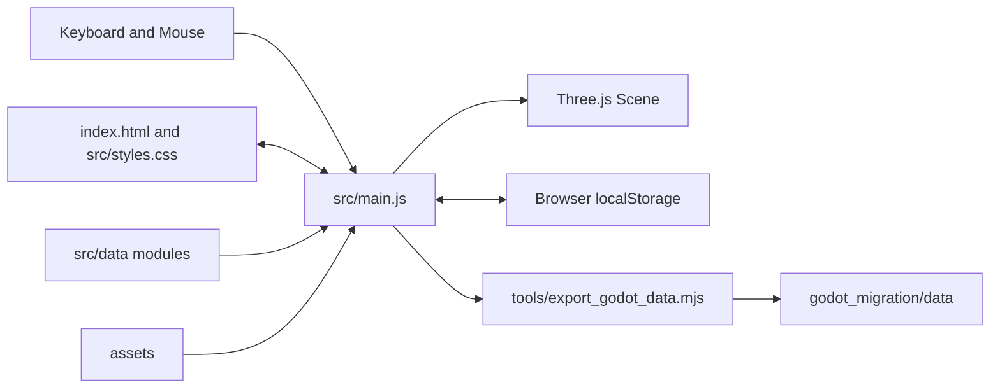
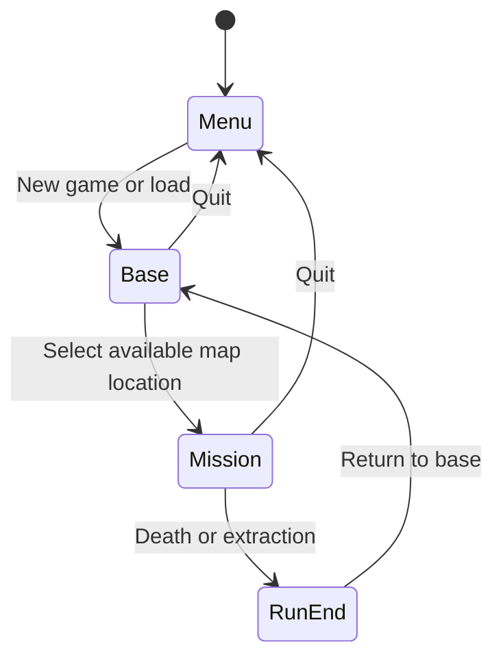

# Architecture

This document describes the current Three.js prototype as implemented. It is a guide to the existing code, not a proposal for an idealized rewrite.

## System Context



The application is a single-page browser game. Vite serves `index.html`, loads `src/main.js` as an ES module, and copies runtime assets during production builds.

## Runtime Entry and Lifecycle

`src/main.js` performs three startup calls after creating global runtime variables:

1. `initThree()` creates the scenes, renderer, orthographic camera, lighting, and settings bindings.
2. `showMainMenu()` enters menu mode.
3. `animate()` starts the permanent `requestAnimationFrame` loop.

The principal modes are:



Panels and overlays can pause interaction without changing the high-level mode. `isPaused()` is the contract used by movement and simulation checks.

## Source Boundaries

### `src/main.js`

The main module currently owns:

- Audio creation and playback.
- DOM queries and UI event wiring.
- Constants, location definitions, character profiles, enemy types, and runtime item stats.
- Global game state and browser persistence.
- Three.js renderer, scenes, camera, lights, materials, meshes, and sprites.
- Safehouse construction, stations, autonomous survivor movement, and navigation graph.
- Inventory, stash, equipment, quickbar, containers, drag-and-drop, and quantity prompts.
- Mission generation, rooms, doors, keys, loot, exits, fog, and colliders.
- Player movement, action states, animation playback, combat, and interaction.
- Zombie AI, damage, death animation, and persistent corpses.
- Frame updates, spatial collision lookup, line of sight, camera, and resizing.

This concentration makes the file easy to search but gives it a large regression radius. Avoid broad rewrites. New extraction should be incremental and behavior-preserving.

### `src/data/itemDatabase.js`

This module builds and freezes `ITEM_DATABASE` from item groups. It owns:

- Broad item labels and IDs.
- Loot taxonomy through `LOOT_TAGS`.
- Universal/container eligibility.
- Legacy-to-canonical aliases through `ITEM_ALIASES`.
- New item metadata such as description, rarity, stack limits, spawn quantity, intended use effects, location exclusions, and crafting flags.

Not all metadata is consumed by the current runtime. In particular, hunger, thirst, stamina buffs, returned containers, and many rarity/spawn rules are data definitions for future integration.

### `src/data/houseMissionTemplates.js`

Exports four handcrafted house graphs. Each template defines:

- Room grid coordinates and labels.
- Entrance room and exterior side.
- Explicit room connections.
- Placeholder furniture placements.
- Probabilistic container sockets.
- Probabilistic loose-loot sockets.

### `src/styles.css` and `index.html`

`index.html` is the stable DOM contract for all HUDs, panels, and modals. `src/styles.css` owns presentation, responsive behavior, and the charcoal/gunmetal/rust UI language. JavaScript commonly renders station and inventory contents with HTML templates, so class names are a contract between the files.

### `src/vendor/three.module.js`

The game runtime imports this vendored Three.js module directly. `package.json` also declares `three`, but changes to the dependency alone do not change the runtime import. Treat a Three.js upgrade as a dedicated task.

## Global State Model

The mutable `state` object is the persistent gameplay core:

```text
mode
character
health
keys
runSeed
characterLoadouts
inventory / quickbar / activeQuickSlot / magazines / equipment
stash
upgrades
settings
activeLocation
```

Each playable character has an independent loadout. `syncActiveCharacterLoadout()` points the top-level inventory/equipment properties at the active character's loadout. Code that replaces those arrays or objects must preserve this relationship.

Transient world state is held in module-level variables such as `player`, `zombies`, `deadZombies`, `lootNodes`, `lootContainers`, `colliders`, `doorNodes`, `missionRooms`, and UI interaction flags. `clearScene()` resets these collections between base and mission scenes.

## Frame Loop

`animate()` clamps delta time with `MAX_FRAME_DT` and coordinates the update order. Major mission updates include:

1. Player input, sliding collision, facing, and action state.
2. Door animations and timed player actions.
3. Zombie AI and directional animation.
4. Persistent corpse animation completion.
5. Interaction discovery and world-space UI.
6. Camera, fog of war, notices, HUD, and render.

Keep update functions deterministic with respect to the supplied `dt` where practical. Avoid creating textures, materials, or large arrays inside per-frame paths.

## Rendering Model

- A shared `WebGLRenderer` renders either the main-menu scene or the game scene.
- Both base and missions use an orthographic camera for the isometric view.
- Environments are Three.js meshes with `MeshStandardMaterial` textures.
- Characters and zombies are camera-facing sprites backed by horizontal sprite sheets.
- Pixel-art textures use nearest-neighbor magnification.
- Environment objects use shadows, fog, and standard-material roughness/metalness.
- The base is a hand-authored mesh composition; missions are generated from room graphs.

## Mission Generation

`startMission()` initializes run state and calls `buildMission()`.

House missions use `createHouseMissionLayout()` and one randomly selected handcrafted template. Other locations use up to 12 procedural attempts through `buildMissionLayoutAttempt()`.

The procedural generator guarantees:

- A connected room graph.
- At least one door connection per room.
- An exterior entrance and spawn outside the first room.
- Locked-room keys in earlier accessible rooms.
- Bounds colliders around the complete mission.

`validateMissionLayout()` is the core invariant check. Any change to generation must retain or extend those checks.

The seeded `rng` drives layout and spawn choices during a run. `Math.random()` is still used in some audiovisual or non-critical paths, so the full game is not a deterministic replay system.

## Collision and Visibility

Collision uses simple object bounds rather than a physics engine.

- `moveWithSlide()` resolves movement per axis so entities slide along walls.
- `colliderGrid` partitions colliders into `COLLIDER_CELL_SIZE` cells.
- `getNearbyColliders()` avoids testing every object for every move.
- `hasLineOfSight()` raycasts against objects marked `blocksSight`.
- Room fog combines room membership and line-of-sight visibility.
- Open doors stop blocking sight; closed doors block it.

Whenever colliders are added, removed, opened, or moved, mark the collider grid dirty when required.

## Player Action and Animation State

`PLAYER_ACTION_STATES` defines Idle, walk, run, aim, pickup, interact, death, attack, `2hAttack`, shoot, `2hShoot`, work, and victory. `PLAYER_ACTION_CONFIG` defines priority, duration, looping, movement lock, and terminal behavior.

The state controller chooses an action independently from its sprite clip. `getClipForPlayerAction()` can intentionally fall back to idle or aim when final artwork does not exist. The `Y` debug panel reports expected state, active clip, texture, quickbar slot, and diagnosis.

Do not add animation-specific conditionals directly to movement code when the action-state controller can represent the behavior.

## Item Architecture

Items currently merge two sources:

1. `ITEM_DATABASE` supplies canonical data, tags, aliases, and item metadata.
2. `itemCatalog` supplies runtime-specific icons, equipment slots, weapon values, armor, backpack sizes, healing values, and ammunition behavior.

During startup, database entries are merged into `itemCatalog`. This means a field in `ITEM_DATABASE` can override an identically named runtime field. Test item use, stacking, labels, and icons after changing either layer.

`itemTexturePaths` maps runtime texture keys to icon files. After item or texture changes, regenerate the Godot JSON exports.

## Persistence

Two browser keys are used:

- `outbreak.save.v1`: game save payload.
- `outbreak.settings.v1`: resolution and volume settings.

The versioned save payload includes survivor selection, health, run seed, all character loadouts, stash, keys, and station upgrades. Missions themselves are not resumed; loading returns to the base.

When persistent fields change:

1. Increment or deliberately retain `SAVE_VERSION`.
2. Update `createSavePayload()`.
3. Add tolerant defaults or migration logic in `loadSavedGame()`.
4. Test a new save and a previous-version/partial save.
5. Update documentation and Godot export data when relevant.

## UI Architecture

Most windows are static shells in `index.html` populated by render functions in `src/main.js`. Examples include:

- `renderInventory()`
- `renderItemBoxPanel()`
- `renderRestStationPanel()`
- `renderMapPanel()`
- `renderLootContainerWindow()`

UI overlays use the `hidden` class as their main visibility contract. Inventory and modal screens pause gameplay. Event handlers are often rebound after `innerHTML` replacement, so render functions must also call their matching wiring functions.

## Audio

Audio uses browser `Audio` elements rather than Three.js positional audio. Music is switched by mode/location. Sound-effect pools clone source nodes for overlapping playback. Browser autoplay restrictions are handled by synchronizing music after pointer or keyboard input.

## Godot Migration Boundary

`tools/export_godot_data.mjs` reads current JavaScript data and writes JSON under `godot_migration/data/`. The generated JSON is a migration artifact, not the browser runtime source of truth.

Do not port `src/main.js` line by line. The Godot plan treats current player-facing behavior and data as the specification while rebuilding scenes, signals, resources, collision, UI, and animation natively.

## Architectural Risks

- `src/main.js` has broad ownership and a large regression surface.
- Runtime items are split between two data layers.
- DOM templates and CSS classes are coupled by string names.
- No automated tests currently protect generation, inventory, or save migration.
- Many assets are imported by string paths, so broken paths are found at runtime.
- Some action states use temporary clip fallbacks.
- Generated Godot data can drift if the exporter is not rerun.

## Recommended Modularization Order

When modularization is explicitly requested, extract in this order:

1. Pure item normalization and inventory helpers.
2. Save payload and migration helpers.
3. Mission layout generation and validation.
4. Animation clip definitions and action-state selection.
5. Safehouse and mission scene builders.
6. UI renderers and event wiring.
7. Entity update systems.

Each extraction should preserve behavior, add a narrow test where possible, and avoid mixing refactoring with new gameplay features.
