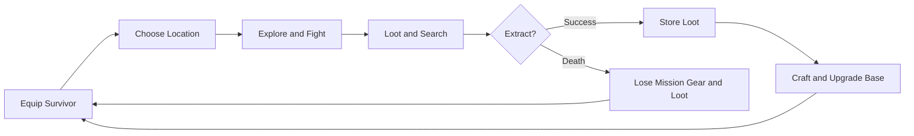

# Game Design

## High Concept

Outbreak is an isometric survival-horror extraction game set during a zombie outbreak. The player maintains a survivor safehouse, chooses dangerous locations to raid, retrieves specialized supplies, and invests those supplies into equipment and base progression.

The visual identity combines 3D environments with pixel-art characters, enemies, and items. Runs should feel tense, readable, and materially different without becoming arbitrary or impossible to reason about.

## Design Pillars

### Preparation Has Consequences

Equipment, ammunition, healing supplies, armor, backpack capacity, and survivor choice should meaningfully change the risk of a run. Taking better gear increases survival odds but raises what can be lost.

### Enter, Loot, Extract

Every mission needs a clear spatial progression from an exterior entry point into a dangerous complex and back toward an extraction point. The player chooses how deep to push before leaving.

### Locations Have Identity

Loot follows the fiction of the location. Hospitals favor medicine, police stations favor weapons and armor, supermarkets favor food and drink, hardware locations favor tools and construction resources, and houses offer mixed civilian supplies.

### Randomized, Not Meaningless

Enemy placement, loot, containers, keys, locked doors, exits, and layout selection can vary. Connectivity and progression rules must prevent soft locks and incoherent rooms.

### The Safehouse Is a Place

The base is not a menu backdrop. Survivors inhabit a visible room, stations exist as world objects, and the player interacts by clicking those objects. Progress should eventually change the base visually and mechanically.

### Horror Through Pressure

Limited visibility, sound, ammunition pressure, persistent corpses, uncertain containers, and the cost of death create tension. Difficulty should come from decisions and pressure, not untelegraphed unfairness.

## Core Loop

## Location Model

The intended world map can include:

- Police station
- Supermarket and small markets
- Gas station
- Church
- Houses and apartments
- Fire station
- Hospital, clinic, and veterinarian clinic
- Prison
- Pharmacy
- Hardware store and tool shop
- Mechanic and garage
- Office
- Mall
- Small, medium, and large stores
- Warehouses, technical sites, and military facilities

Each location has a one-to-five-star threat rating. Stars communicate a combined expectation of:

- Enemy quantity and strength.
- Location size and exploration time.
- Lock, puzzle, and navigation complexity.
- Loot quantity, quality, and specialization.

A one-star police station might contain a handgun, limited ammunition, a baton, basic healing, and low-grade armor with sparse zombies. A five-star police facility can justify rifles, substantial ammunition, high-grade armor, more rooms, and heavy enemy pressure.

Stars are not permission to ignore location identity. A five-star clinic should still provide medical and clinical resources rather than arbitrary military loot.

## Mission Structure

Required mission rules:

- Spawn outside the main complex.
- Provide a visible entrance into the location.
- Give every room at least one door connection.
- Make the full room graph traversable.
- Place locked-door keys somewhere accessible before the lock.
- Never place a key inside the room it unlocks when that would create a soft lock.
- Support unlocked, locked, open, and closed visible doors.
- Provide the entry point as an extraction option.
- Generate one or two additional extraction points far from entry when layout permits.
- Prevent the player from leaving the playable bounds.
- Keep loose loot, containers, enemies, and exits clear of invalid collision space.

Future puzzles can gate doors, lockers, safes, chests, and specialized rooms. Puzzle placement must follow the same accessibility rules as keys.

## Failure and Loss

The current prototype returns the player to the base after death. The intended risk model is that equipment brought into the mission and loot collected during the run are lost.

Long-term planned systems deepen this:

- Survivor permadeath.
- Location-specific injuries.
- Infection that can be delayed, treated, or eventually cured.
- A deceased infected survivor potentially becoming a zombie.
- Automated scavenging missions with lower yield and simulated risk.

These systems require explicit save migration, roster UI, recovery rules, and fair feedback before activation.

## Safehouse Stations

### Item Box

Stores extracted items and equipment. Capacity grows through upgrades. The player can transfer between stash, carried inventory, and equipment while at base.

### Workbench

Intended for ammunition, weapon repair, improvised tools, and later crafting tiers. Current crafting presentation is partly prototype UI.

### Medical Unit

Heals the active survivor and will eventually treat wounds, trauma, and infection. Upgrades improve available treatments.

### Intel Center

Expands known map locations, reveals threat information, and provides the current no-cost save action.

### Map Table

Displays scouted and unscouted destinations, threat rating, category, possible loot, and Intel requirements.

### Rest Station

Displays survivor profiles, equipment, carried items, and switches the active survivor. Active survivors are marked in the safehouse.

### Command Center

Planned owner of base construction, blocked-room clearing, exterior construction, fence upgrades, and base-defense management.

### Kitchen and Bathroom

Present as safehouse spaces/stations with limited prototype behavior. Long-term roles include food recipes, survivor support, hygiene, and condition management.

## Survivor Model

The active roster currently includes Ava Belmont, Peter Ashfield, Alynne, and Luis. Each has independent equipment and inventory.

Planned survivor depth includes:

- Health, stamina, fighting, shooting, and looting statistics.
- Backgrounds and traits.
- Unique abilities and recipes.
- Injury and infection state.
- Relationships or morale only if they support the survival loop.

An example future trait is Ava's Survivalist background improving health/stamina or unlocking kitchen recipes. This is design direction, not current runtime behavior.

## Inventory and Equipment

Equipment slots:

- Primary weapon
- Sidearm
- Armor
- Backpack

The base backpack provides six carried slots. Medium and large backpacks increase capacity to eight and ten. Equipped items do not occupy carried slots. Unequipping into a full inventory drops the item into the world where applicable.

Items can carry category tags and weapon subtypes:

- Weapon: one-handed/two-handed and melee/firearm
- Aid
- Food
- Drink
- Base resource
- Ammunition
- Armor
- Equipment
- Key

The broader database also tracks loot-domain tags for food/drink, medical, hardware, technical, collectibles, weapons, ammunition, backpacks, armor, and special items.

## Visual Direction

### World

- Isometric orthographic presentation.
- Three-dimensional rooms, walls, doors, furniture, fences, props, and lighting.
- Pixel-art survivors, zombies, and item presentation.
- Worn practical materials: aged wood, stained concrete, torn wallpaper, dirty glass, and restrained rust.
- Readable silhouettes and interaction spaces are more important than decorative density.

### UI

- Charcoal and gunmetal frames.
- Squared, compact industrial silhouettes.
- Recessed near-black content areas.
- Rivets and small corner fasteners.
- Restrained copper-brown rust at edges.
- Warm off-white text, muted red health, and mustard-yellow accents.

The external UI pack supplied during development is a style reference unless direct use is explicitly requested.

### Item Icons

Inventory icons follow `ITEM_ICON_STYLE_GUIDE.md`: polished pixel art, transparent `128x128` PNGs, dark warm outlines, three-quarter presentation where useful, restrained wear, fictional branding, and consistent scale.

## Progression Roadmap

Planned progression systems:

1. Clear blocked safehouse rooms.
2. Assign and construct full-room stations.
3. Build exterior gardens, dormitories, watchtowers, and utility structures.
4. Upgrade the perimeter fence.
5. Resolve base attacks as playable defense missions or simulations.
6. Improve survivor stats, traits, and abilities.
7. Treat injuries and infection.
8. Unlock a rare late-game cure objective.
9. Send inactive survivors on automated missions.

Implement these incrementally. A feature is not complete until it has gameplay behavior, UI, persistence, feedback, failure handling, and migration coverage.
