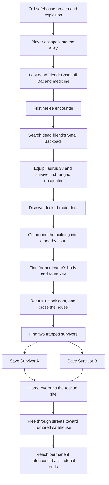

# Opening Act and Basic Tutorial

This document is the authoritative narrative and level-design reference for the opening act of Outbreak. It defines the destruction of the player's original safehouse, the escape tutorial, the first major survivor choice, and the journey to the permanent safehouse.

`CURRENT_BUILD.md` remains authoritative for implemented behavior. The opening act described here is **planned** and must not be presented as playable until its level, narrative, UI, persistence, failure handling, and browser flow are implemented and verified.

## Canon Status

### Confirmed

- The player belonged to an established survivor community before the playable story begins.
- The community's safehouse is breached during a large infected attack.
- An explosion occurs at the old safehouse during the breach or escape.
- The player's friends die during the failed escape.
- The player escapes alone and initially has no usable equipment.
- The escape from the destroyed safehouse is the basic gameplay tutorial.
- The player obtains their first melee weapon and medical supplies from a dead friend.
- The player obtains a backpack, food, drink, a Taurus 38 revolver, and a small amount of RT 85 ammunition from another dead friend.
- The player retrieves a key beside the body of the community's former leader.
- The key opens a locked door on the required route.
- The player encounters two trapped survivors threatened by an approaching horde.
- Only one trapped survivor can be rescued.
- The rescued survivor knows about a nearby abandoned safehouse and guides the player toward it.
- The explosion at the old safehouse drew away much of the infected concentration that had previously made the new safehouse inaccessible.
- The player and rescued survivor reach the new safehouse, ending the basic tutorial.

### Pending

- The player's identity and whether the opening uses a selected survivor, a custom protagonist, or another character framework.
- The old community's name, size, history, internal relationships, and exact number of casualties.
- The names and backgrounds of the dead friends encountered during the tutorial.
- The identities, factions, injuries, abilities, and later story roles of the two trapped survivors.
- The exact cause of the old safehouse explosion.
- The exact medical items, food, drink, revolver ammunition count, and weapon condition used for tutorial balance.
- The neighborhood, street names, and buildings used by the tutorial route.
- The rescued survivor's exact source of knowledge about the new safehouse.
- Whether the unrescued survivor's presumed death is shown directly or left unseen after the horde arrives.
- The exact state of the permanent safehouse when the pair enters it.

## Narrative Purpose

The opening must accomplish four things at the same time:

- Establish that the player had a life and community before the main game.
- Make the loss of carried resources, companions, and shelter emotionally meaningful rather than a mechanical reset.
- Teach the basic controls through urgent actions that make sense within the escape.
- End with limited hope: the player has lost their old community but saves one person and reaches a defensible location from which a new community can begin.

The tutorial should not feel like a detached training course. Every mechanic is introduced through an immediate survival problem, and every item comes from a specific person or place.

## Opening Conditions

- Time: late afternoon, moving toward evening and night during the escape.
- Location: an older residential or mixed-use neighborhood within the fictional city. The exact district remains pending.
- Recent event: the old safehouse has been breached, followed by an explosion.
- Immediate environment: fire, smoke, alarms, collapsing barricades, scattered infected, fleeing or dying community members, and a larger horde moving toward the blast.
- Player condition: alive, shaken, unbitten, and able to move, but without usable equipment.
- Player knowledge: the player knows the local streets and recognizes the dead community members but does not yet know about the permanent safehouse.

The player should begin in control quickly. Any non-interactive introduction must be brief enough that the first movement input feels like part of the escape rather than the start of a separate scene.

## Tutorial Flow

## Beat 1: The Breach

### Narrative

- The old safehouse has already failed when full player control begins.
- The player has just escaped the immediate structure or barricaded compound.
- The explosion behind the player marks the destruction of the community's home and draws the larger infected mass toward it.
- Friends are separated, dead, or overwhelmed during the escape. The player cannot return to rescue the community.
- The route ahead is an alley or narrow service lane that limits navigation while preserving the sense of a larger disaster beyond it.

### Tutorial function

- Teach movement.
- Teach camera orientation and facing.
- Teach running if running is available at this point.
- Establish that environmental boundaries are physical and readable rather than invisible arbitrary walls.

### Level requirements

- The destroyed safehouse must remain visible or audible long enough to orient the player emotionally and spatially.
- Returning to the safehouse must be blocked by a credible danger such as fire, collapse, or overwhelming infected rather than an unexplained invisible barrier.
- The first path should be controlled but not resemble a featureless corridor.

## Beat 2: First Ground Loot

### Narrative

- In the alley, the player finds the first dead friend from the old community.
- A Baseball Bat lies on or beside the body.
- Medical supplies are also recoverable from the body or the immediate ground.
- The player's recognition of the friend should be communicated through a short line, name prompt, portrait, or environmental detail. The body must not feel like an anonymous tutorial container.

### Tutorial function

- Teach interaction prompts.
- Teach picking up loose items from the ground.
- Teach opening the inventory.
- Teach equipping the Baseball Bat.
- Teach using a medical item if the player begins with minor damage; otherwise explain medical use without forcing waste.

### Canonical items

- **Baseball Bat** is confirmed.
- The exact medical supplies remain pending. They must use canonical item IDs from `ITEM_DATABASE.md`.

### Level requirements

- The Baseball Bat must be impossible to miss and cannot be lost through random spawning.
- The route to the first zombie should not open until the player has had a clear opportunity to equip the bat.
- Medical supplies should not require the player to desecrate or search an abstract body inventory if the intended lesson is loose ground pickup.

## Beat 3: First Melee Combat

### Narrative

- A single ordinary infected blocks the alley or emerges from a readable nearby space.
- It is the player's first unavoidable combat encounter.
- The encounter should feel dangerous but controlled, reflecting the player's panic and inexperience without demanding mastery.

### Tutorial function

- Teach aiming or combat stance.
- Teach melee attacks.
- Teach distance and attack timing.
- Teach zombie death confirmation and corpse persistence.
- Optionally introduce stamina only if the stamina system is implemented before this tutorial is produced.

### Encounter requirements

- Use an ordinary low-pressure infected, not a special mutation.
- Prevent additional infected from entering until the player has learned the basic melee loop.
- Provide enough space to reposition without allowing the player to bypass the encounter accidentally.
- Checkpoint before or immediately after the encounter according to final tutorial failure rules.

## Beat 4: First Container Search

### Narrative

- Farther along the alley, the player finds a second dead friend clutching or lying against a Small Backpack.
- The backpack was packed during the community's attempted escape, explaining why it contains survival supplies and a weapon.
- The backpack contains food, drink, a Taurus 38 revolver, and a small amount of RT 85 ammunition.
- The backpack itself becomes the player's first equipable backpack after its contents are searched.

### Tutorial function

- Teach searching a container.
- Teach delayed or progressive item reveal if the final tutorial uses the standard container-search behavior.
- Teach transferring items from a container.
- Teach equipping a backpack and the resulting inventory-capacity increase.
- Teach equipping a sidearm.
- Teach the distinction between a firearm and its matching ammunition.
- Teach reload or cylinder loading if the revolver is not found ready to fire.

### Canonical items

- **Small Backpack** is the default confirmed backpack tier for this scene unless later balance testing approves another tier.
- **Taurus 38** is confirmed.
- **RT 85** is the Taurus 38 ammunition and is confirmed.
- Food and drink are confirmed categories; their exact canonical items remain pending.
- The exact ammunition count and whether rounds begin inside the cylinder remain pending tutorial-balance decisions.

### Level requirements

- The container and its owner must be visually associated so the player understands that the backpack belonged to the dead friend.
- The interaction must not imply that a Small Backpack is stored inside itself. The world backpack acts as the searchable container and then becomes equipable, or the search concludes by granting that same backpack item through an explicit transition.
- Required tutorial items cannot be randomized, excluded, or hidden behind search luck.
- The player must have enough inventory capacity to take all required items.
- The firearm cannot be left permanently unusable through accidental ammunition transfer or an unclear reload prompt.

## Beat 5: First Ranged Combat

### Narrative

- Shortly after leaving the backpack, the player encounters another ordinary infected at a distance suitable for the revolver.
- The environment discourages immediate melee contact and gives the player time to read the firearm prompts.
- The gunshot contributes to local pressure and reminds the player that firearms solve immediate problems while creating noise.

### Tutorial function

- Teach selecting the sidearm.
- Teach aiming and shooting.
- Teach ammunition display and cylinder state.
- Teach reloading if it was not required at the backpack.
- Teach that projectiles and walls matter.
- Introduce firearm noise only if zombie sound attraction is implemented for the final tutorial.

### Encounter requirements

- The player must have enough ammunition to defeat the intended target despite a reasonable number of missed shots.
- The tutorial must not require a critical hit.
- The target should be separated from the player by distance or geometry but remain inside the Taurus 38's effective tutorial range.
- Any remaining rounds after the encounter should be deliberately balanced to preserve scarcity.

## Beat 6: Locked Door and Court Detour

### Narrative

- The player reaches a locked exterior or service door on a damaged house that blocks the direct route forward.
- The prompt identifies that a specific route key is required.
- The player can move around the building through a nearby court, yard, or enclosed recreation space.
- In the court, the player finds the body of the old community leader.
- The required key lies beside the leader's body and is visibly associated with them.
- The player retrieves the key, returns to the locked door, unlocks it, and enters the house.

### Tutorial function

- Teach locked-door feedback.
- Teach observing alternate routes.
- Teach key discovery and pickup.
- Teach returning to and unlocking a specific door.
- Reinforce that exploration resolves obstacles.

### Key requirements

- The tutorial key must eventually receive a unique, map-specific name rather than remain the generic runtime Key.
- The key must never spawn randomly or behind its own locked door.
- The old leader's possession of the key must be explained by their role in the escape route, access to the building, or prior planning.
- The detour should provide a meaningful emotional discovery, not exist only to lengthen the tutorial.

### Encounter requirements

- The court may contain one controlled combat or avoidance problem, but it must not overwhelm the key lesson.
- The player must be able to find the leader and key without pixel hunting.
- The path back to the door should be shorter or safer than the initial detour.

## Beat 7: Interior Transition

### Narrative

- The unlocked house creates a brief transition from exposed streets into a damaged interior.
- Signs of recent collapse, movement, and fighting lead the player toward voices or impact sounds.
- The player reaches a room, courtyard exit, or partially collapsed passage where two survivors are trapped beneath a fallen wall section.

### Tutorial function

- Reinforce doors, interior navigation, line of sight, and interaction.
- Give the player a short reduction in combat pressure before the major decision.
- Prepare the rescue interaction without introducing a new complex system immediately beforehand.

### Level requirements

- The building must remain fully traversable along the required route.
- Every accessible room must have a credible entrance or door.
- The collapse must look recent and structurally connected to the damaged house.
- The two survivors must be visible or audible before the horde reaches them.

## Beat 8: The Rescue Choice

### Situation

- Two survivors are pinned beneath different parts of a collapsed wall or connected debris field.
- Both are conscious and capable of speaking.
- Neither is bitten.
- The player has time to free only one before the horde reaches the position.
- The obstruction and injuries must make it physically impossible to release both within the available time.
- Each survivor should be able to communicate enough personality, urgency, and practical value for the choice to feel human rather than cosmetic.

### Player choice

- The player selects one survivor to rescue through a clear, deliberate interaction.
- Starting the rescue commits the choice after an explicit warning or unmistakable staging.
- The rescued survivor becomes the player's first companion.
- The unselected survivor is left behind as the horde overruns the area and is presumed killed.
- The sequence immediately transitions into flight; the player cannot remain and reverse the choice.

### Tutorial function

- Teach a sustained interaction or rescue action.
- Introduce consequential narrative choices.
- Establish that not every person can be saved.
- Introduce the first recruitable companion and, later, their faction connection.

### Choice requirements

- The choice must not be secretly correct or incorrect.
- Neither survivor should be framed as obviously disposable.
- Their identities, factions, gameplay advantages, flaws, and future questlines remain pending.
- The player must understand that only one can be saved before committing.
- The time pressure may be presented dramatically, but menu-reading or dialogue time should not unfairly kill the player.
- The saved survivor must remain usable regardless of which option is selected.
- Future writing must treat the unrescued survivor as dead unless an explicit later canon decision establishes a credible survival outcome.

## Beat 9: Flight Toward the New Safehouse

### Narrative

- As the pair escapes, the rescued survivor tells the player about a large, fenced house nearby that had been considered as a potential safehouse.
- The property was abandoned as an option because the surrounding streets held too many infected.
- The old safehouse explosion drew much of that concentration toward the destroyed community.
- The rescued survivor concludes that the route may now be temporarily passable.
- This is a desperate inference, not certainty: some infected remain, and the horde may eventually disperse or return.

### Dialogue goals

- Identify the destination without explaining its full history.
- Explain why the rescued survivor knows of it, once that background is finalized.
- Explain why the route is possible now but was not possible earlier.
- Keep dialogue short enough to occur during movement and combat.
- Allow the rescued survivor's personality to affect delivery without changing the established facts.

### Tutorial function

- Combine previously learned movement, looting, melee, firearm, healing, and door interactions.
- Introduce fighting while protecting or traveling with an NPC only if companion behavior is sufficiently reliable.
- Let the player choose when to use scarce revolver ammunition.
- Transition from tightly controlled lessons to a short integrated survival test.

### Route requirements

- The route crosses several streets or connected exterior spaces without exposing the entire city map.
- Remaining infected should appear in small, readable groups left behind by the horde's movement.
- The player should encounter optional supplies but no item essential to completing the tutorial.
- The rescued survivor cannot die permanently during the basic tutorial unless a separate failure-and-restart design is approved.
- The path must make the explosion's effect visible through reduced infected density, distant horde movement, smoke, sound, or environmental aftermath.

## Beat 10: Arrival at the Permanent Safehouse

### Narrative

- The pair reaches the large fenced property that will become the permanent safehouse.
- The exterior should immediately communicate defensive potential: fencing, controlled access, a garage, multiple rooms, and space for future improvements.
- The property also communicates unease through its isolation, security measures, damaged systems, or signs that its former owner concealed something.
- The player and companion secure initial entry.
- Reaching the property ends the basic escape tutorial.

### Tutorial endpoint

- The game records the trapped-survivor choice.
- The rescued survivor becomes the first companion.
- The player's surviving tutorial inventory carries into the safehouse unless a later onboarding event deliberately changes it.
- A checkpoint or first permanent save opportunity should occur before the player can lose tutorial progress.
- Safehouse onboarding, station construction, scientist evidence, suppressant discovery, and broader progression belong to the next tutorial phase rather than this basic escape sequence.

## Tutorial Inventory Continuity

The following items form the confirmed opening inventory path:

| Source | Confirmed contents | Purpose |
| --- | --- | --- |
| Dead friend in alley | Baseball Bat; medical supplies | Ground pickup, inventory, melee, healing |
| Dead friend's Small Backpack | Small Backpack; food; drink; Taurus 38; limited RT 85 | Container search, capacity, survival supplies, firearm and ammo |
| Former leader in court | Map-specific route key | Key discovery and locked-door interaction |

Rules:

- These required items are hand-placed and never randomized.
- All item names must resolve to canonical records in `ITEM_DATABASE.md`.
- Items collected during the tutorial remain with the player on arrival unless explicitly revised.
- Exact quantities and starting conditions remain balance decisions, not lore facts.
- The tutorial must tolerate the player using medical supplies or ammunition before reaching the safehouse.
- The player cannot consume, discard, or lose an item that is still required to advance without a recovery path.

## Checkpoints and Failure

### Planned requirements

- Tutorial deaths reload a checkpoint rather than trigger survivor permadeath.
- Recommended checkpoint positions are:
  - After the opening breach and movement introduction.
  - After the first melee kill.
  - After transferring the backpack contents.
  - After retrieving the route key or unlocking the door.
  - Immediately before the trapped-survivor choice.
  - After escaping the horde with the chosen survivor.
- Reloading must restore required items, ammunition, zombie state, door state, key state, and the uncommitted survivor choice consistently.
- Once the choice is committed and checkpointed, reloading should preserve that choice unless the player deliberately restarts the opening act.
- The permanent permadeath rules begin only after safehouse onboarding clearly explains them, if permadeath remains part of the final design.

## Pacing Targets

Exact duration must be established through playtesting. The intended rhythm is:

1. Immediate disorientation and movement.
2. Quiet recognition of the first dead friend.
3. Controlled melee danger.
4. A second emotional discovery and slower container search.
5. Brief ranged-combat empowerment followed by ammunition scarcity.
6. Exploration and the discovery of the former leader.
7. Interior tension and reduced combat pressure.
8. A fast, irreversible rescue decision.
9. Integrated street escape with the chosen companion.
10. Relief and unease at the new safehouse.

The tutorial should alternate pressure and recovery. Continuous combat would weaken the dead-friend discoveries and make the rescue choice feel like another obstacle rather than the emotional center of the opening.

## Continuity and Plot-Hole Protections

- The old safehouse explosion must have a later-defined physical cause and cannot occur only to move the horde for the plot.
- The explosion draws infected toward the old safehouse; it does not eliminate them or guarantee a safe route.
- The rescued survivor needs a specific, credible reason to know the new safehouse and its location.
- The former leader needs a specific, credible reason to possess the route key.
- The second dead friend packed the backpack during the evacuation, explaining the combination of food, water, weapon, and ammunition.
- The player cannot rescue both trapped survivors because of physical obstruction, injuries, rescue time, and the visibly approaching horde—not because the game arbitrarily disables the second interaction.
- The rescued survivor cannot be treated as interchangeable after the choice. Later dialogue, relationships, faction access, and quests should reflect who survived.
- The permanent safehouse must already conform to the placement rules in `CITY_CANON.md`.
- The tutorial route must fit a named neighborhood and preserve all future city-map roads and landmarks once those are finalized.
- The player remains unbitten during the opening unless infection rules are deliberately revised later.

## Future Design Work

Before this opening can be considered production-ready, later passes must define:

- The playable protagonist framework.
- The old community and the dead friends encountered along the route.
- The two trapped survivors and their faction connections.
- The old safehouse layout, breach sequence, and explosion cause.
- The tutorial neighborhood and exact route graph.
- The unique route key and locked building.
- Final item quantities, weapon condition, enemy variants, and encounter balance.
- NPC rescue and companion-following behavior.
- Dialogue, barks, cinematics, environmental storytelling, and audio cues.
- Checkpoint persistence and restart behavior.
- The permanent safehouse entry sequence and the handoff into safehouse onboarding.

## Production Acceptance Checklist

- Every required item is reachable and cannot be lost before its lesson is complete.
- Every tutorial gate has an in-world explanation.
- The player cannot become soft-locked by ammunition, inventory capacity, keys, doors, or NPC pathing.
- The two-survivor decision is legible, deliberate, and mechanically irreversible after commitment.
- Both rescue branches reach the permanent safehouse successfully.
- Dialogue variants preserve the same confirmed route and explosion facts.
- Checkpoints restore world and choice state correctly.
- Tutorial deaths do not invoke permanent loss.
- The final inventory matches what the player actually collected and used.
- The route is consistent with `CITY_CANON.md`.
- Planned mechanics remain labeled planned until verified in the playable build.
